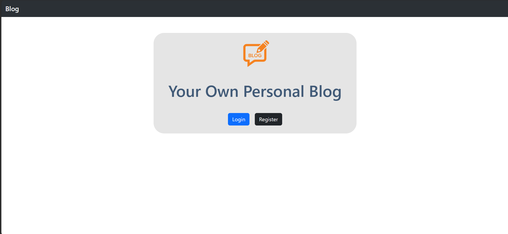
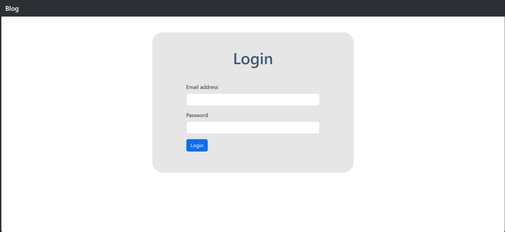
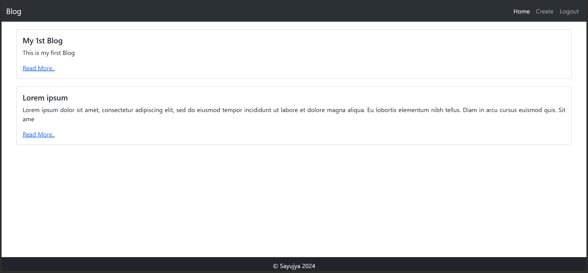
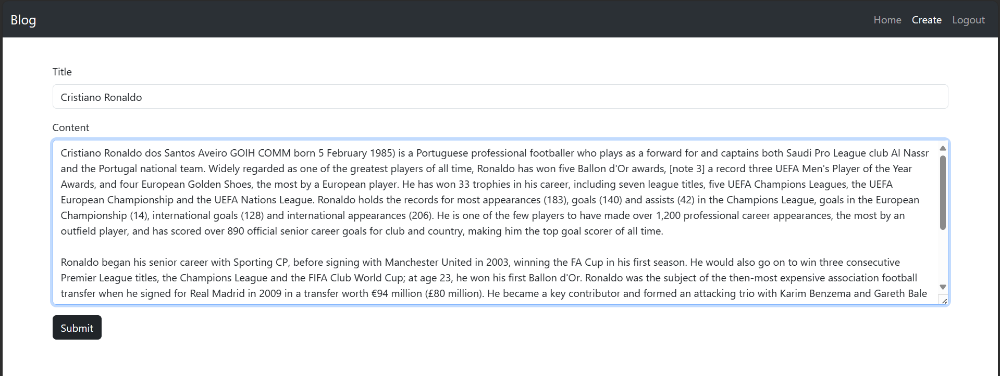

# BLOG APP

A simple project done in laravel and mysql for the completition of 4th Sem Project.

## Steps To Run:

<li> <a href="https://download-directory.github.io/?url=https%3A%2F%2Fgithub.com%2FAyjuYaas%2FBIM%2Ftree%2Fmain%2F04_BIM4th%2F4thSemProject-BlogApp">Download</a> the folder and extract it.
<li>Go to the folder application using <code>cd</code> command on your cmd or terminal.
<li>Run <code>composer install</code> on your cmd or terminal [This might take some time].
<li>Copy <code>.env.example</code> file to <code>.env</code> on the root folder. You can type <code>copy .env.example .env</code> if using command prompt Windows or <code>cp .env.example .env</code> if using terminal, Ubuntu.
<li>Open your <code>.env</code> file and change the database name (<code>DB_DATABASE</code>) to whatever you have, username (<code>DB_USERNAME</code>) and password (<code>DB_PASSWORD</code>) field correspond to your configuration.
<li>Run <code>php artisan key:generate</code>.
<li>Run your <code>local database server (XAMPP)</code>.
<li>Run <code>php artisan migrate</code>.
<li>Run <code>php artisan serve</code>.

## PREVIEW

   
By:
Sayujya Satyal  
021BIM054
